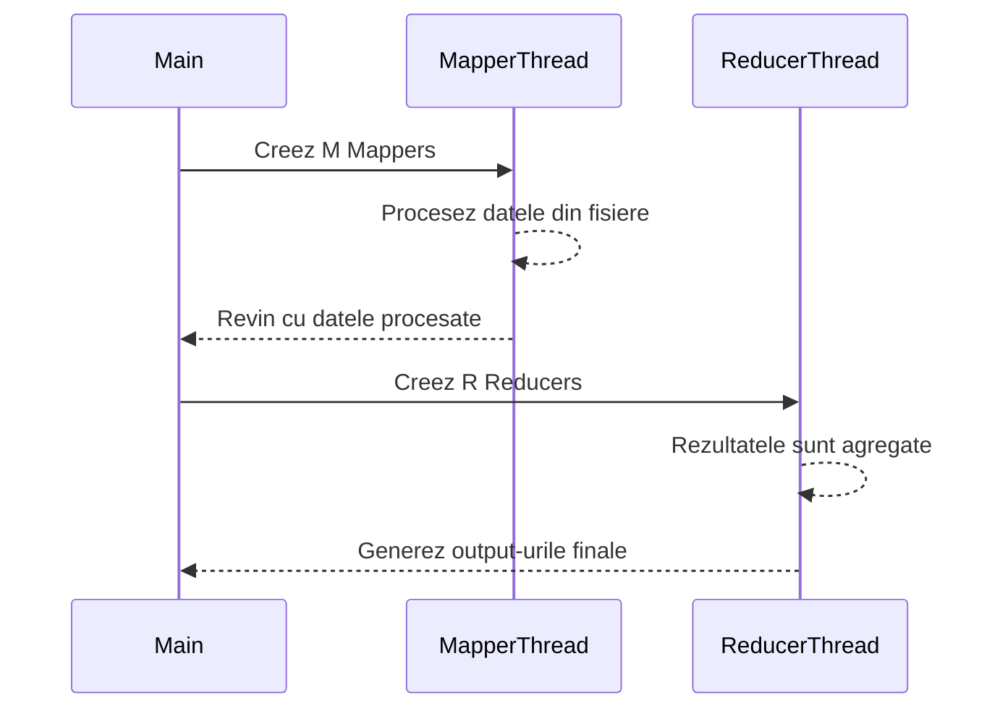
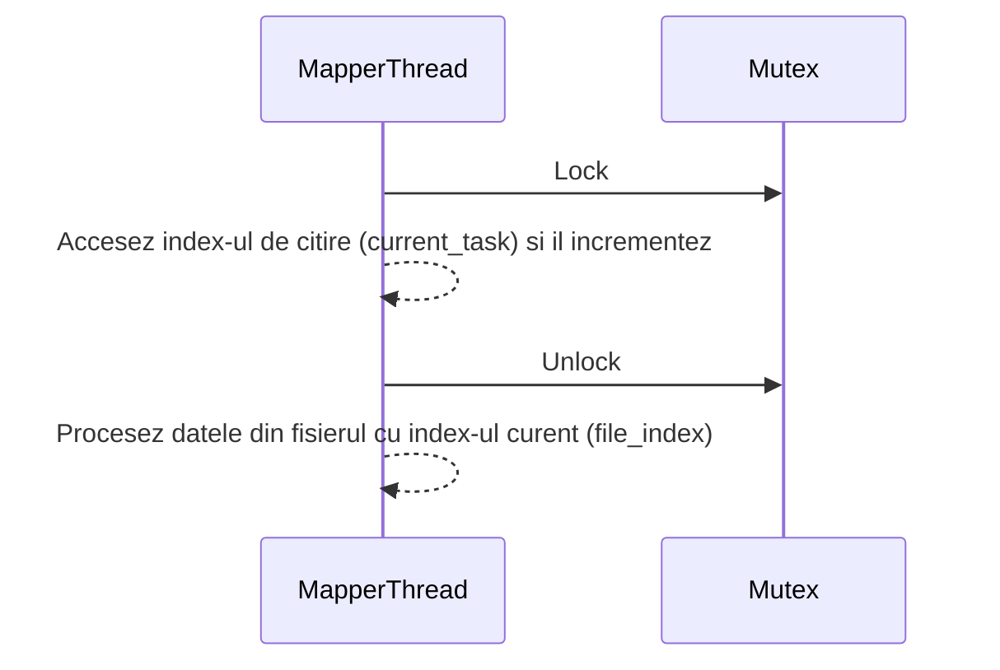
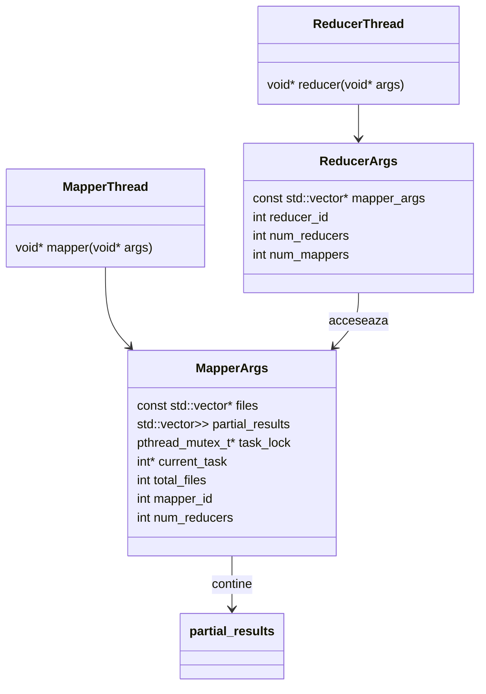

# APD-Map-Reduce

## Descriere

Am realizat o implementare a unui Map-Reduce folosind thread-uri în C++.

Pentru diagramele din acest README, am folosit [Mermaid Live
Editor](https://mermaid-js.github.io/mermaid-live-editor/) si ghidul [Mermaid
Docs](https://mermaid.js.org/intro/).

## De ce am folosit C++?

Pentru ca este mai usor de lucrat cu thread-uri in C++ decat in C, chiar si cu
pthreads.

## Flow-ul programului



## Metodele de sincronizare

### Mapper si citirea din fisiere

Am folosit `pthread_mutex_t` pentru a sincroniza thread-urile mapper intre ele.
Lock-ul proteja accesul la index-ul de citire din fisierele care trebuiau
procesate.



### Intre Mapper si Reducer

Pentru a ma asigura ca thread-urile din Reducer nu incep sa agregheze datele
inainte ca toate thread-urile Mapper sa fi terminat de procesat datele, am ales
sa nu creez thread-urile Reducer decat dupa ce toate thread-urile Mapper au fost incheiate.

Diagrama de mai sus arata ca MapperThread-urile se termina inainte ca
ReducerThread-urile sa fie create.

## Structura Map-Reduce

Am folosit 2 structuri, una pentru Mapper si una pentru Reducer.



## Exemplu de rulare pentru test_small.txt

O sa zicem ca avem M = 2 Mapper si R = 2 Reducer.

Asemenea cerintei, am ales ca M0 sa preia file1.txt, iar M1 sa preia file2.txt
si file3.txt.

```txt
> cat file1.txt
The bright sun shines in the blue sky as birds are singing today.

> cat file2.txt
This calm morning, the sky is blue, and gentle clouds float by.

> cat file3.txt
In the peaceful evening, the stars shine brightly in the quiet sky.
```

Cand fiecare Mapper va procesa datele, in `partial_results` se va gasi o
asociere intre cuvant (prima litera) si reducer-ul care va procesa acea litera,
cu ajutorul functiei `get_reducer_id`.

Pentru ca avem 2 Reducer:

- R0 va procesa cuvintele care incep cu literele de la a la m (0 - 12)
- R1 va procesa cuvintele care incep cu literele de la n la z (13 - 25)

### M0 va procesa file1.txt si va gasi urmatoarele cuvinte:

```txt
the, bright, sun, shines, in, the, blue, sky, as, birds, are, singing, today
```

La finalul procesarii lui file1.txt vom avea tabelul de mai jos pentru tot ce a procesat M0:

| Cuvant  | Prima litera | Reducer asignat |
|---------|--------------|:---------------:|
| the     | t            | R1              |
| bright  | b            | R0              |
| sun     | s            | R1              |
| shines  | s            | R1              |
| in      | i            | R0              |
| blue    | b            | R0              |
| sky     | s            | R1              |
| as      | a            | R0              |
| birds   | b            | R0              |
| are     | a            | R0              |
| singing | s            | R1              |
| today   | t            | R1              |

Stiind deja ce reducer va procesa care litera, fiecare dintre acestia isi va
extrage datele de la Mapper si le va procesa.

Din file1.txt pentru:

- R0

``` txt
{
  "bright": {1},
  "in": {1},
  "blue": {1},
  "as": {1},
  "birds": {1},
  "are": {1}
}
```

- R1

```txt
{
  "the": {1},
  "sun": {1},
  "shines": {1},
  "sky": {1},
  "singing": {1},
  "today": {1}
}
```

### M1 va procesa file2.txt si file3.txt si va gasi urmatoarele cuvinte:

Pentru file2.txt:

```txt
this, calm, morning, the, sky, is, blue, and, gentle, clouds, float, by
```

Pentr file3.txt:

```txt
in, the, peaceful, evening, the, stars, shine, brightly, in, the, quiet, sky
```

Din file2.txt si file3.txt pentru:

- R0

```txt
{
  "calm": {2},
  "morning": {2},
  "is": {2},
  "blue": {2},
  "and": {2},
  "gentle": {2},
  "clouds": {2},
  "float": {2},
  "by": {2},
  "in": {2,3},
  "evening": {3},
  "brightly": {3}
}
```

- R1

```txt
{
  "this": {2},
  "the": {2,3},
  "sky": {2,3},
  "peaceful": {3},
  "stars": {3},
  "shine": {3},
  "quiet": {3}
}
```

Ele inca nu sunt agregate sau ordonate, dar acestea sunt datele care vor fi
procesate de Reducer.

### Reducer 0 proceseaza datele intermediare pentru literele a -> m

Va extrage cu ajutorul `mapper_args` datele din toti Mapper si va procesa datele
relevante, in cazul nostru:

```txt
{  ---MAPPER 0---
  "bright": {1},
  "in": {1,2},
  "blue": {1,2},
  "as": {1},
  "birds": {1},
  "are": {1},
  ---MAPPER 1---
  "calm": {2},
  "morning": {2},
  "is": {2},
  "blue": {2},
  "and": {2},
  "gentle": {2},
  "clouds": {2},
  "float": {2},
  "by": {2}
}
```

Agregate, ele arata asa inainte de a fi ordonate :

| Cuvant | File IDs | Count |
|--------|----------|-------|
| blue   | {1,2}    | 2     |
| in     | {1,2,3}  | 3     |
| and    | {2}      | 1     |
| are    | {1}      | 1     |
| ...    | ...      | ...   |

(Nu am mai avut rabdare sa scriu tot tabelul, dar arata continua tot asa dar
doar cu cuvintele care apar intr-un singur fisier)

Acum acest tabel, care se afla in `combined_results` va fi ordonat in
`sorted_results`.

Avem 2 criterii de ordonare:

1. Numarul de aparitii al cuvantului in toate fisierele, descrescator
2. Alfabetic, daca numarul de aparitii este egal

In final, `sorted_results` va arata asa:

```txt
{
  "in": {1,2,3}, --> 3 aparitii, deci va fi primul
  "blue": {1,2}, --> 2 aparitii, deci va fi al doilea
  "and": {2}, --> de aici toate cuvintele apar o singura data, deci vor fi ordonate alfabetic
  "are": {1},
  ....,
  "float": {2},
  "gentle": {2},
  "is": {2},
  "morning": {2}
}
```

### Reducer 1 proceseaza datele intermediare pentru literele n -> z

Va extrage cu ajutorul `mapper_args` datele din toti Mapper si va procesa
datele relevante, in cazul nostru:

```txt
{  ---MAPPER 0---
  "the": {1},
  "sun": {1},
  "shines": {1},
  "sky": {1},
  "singing": {1},
  "today": {1},
  ---MAPPER 1---
  "this": {2},
  "the": {2,3},
  "sky": {2,3},
  "peaceful": {3},
  "stars": {3},
  "shine": {3},
  "quiet": {3}
}
```

Agregate, ele arata asa inainte de a fi ordonate :

| Cuvant | File IDs | Count |
|--------|----------|-------|
| the    | {1,2,3}  | 3     |
| sky    | {1,2,3}  | 3     |
| shines | {3}      | 1     |
| shines | {1}      | 1     |
| ...    | ...      | ...   |

(Nu am mai avut rabdare sa scriu tot tabelul, dar arata continua tot asa dar
doar cu cuvintele care apar intr-un singur fisier)

Acum acest tabel, care se afla in `combined_results` va fi ordonat in
`sorted_results`. Crtieriile de ordonare sunt aceleasi pentru orice reducer.

In final, `sorted_results` va arata asa:

```txt
{
  "sky": {1,2,3}, --> 3 aparitii
  "the": {1,2,3}, --> 3 aparitii, dar s < t, deci va fi al doilea
  "peaceful": {3}, --> de aici toate cuvintele apar o singura data, deci vor fi ordonate alfabetic
  "quiet": {3},
  ....,
  "stars": {3},
  "sun": {1},
  "this": {2},
  "today": {2}
}
```

### Reducer 0 scrie fisierele de outptut (a.txt -> m.txt)

Pentru fiecare pereche `[word, file_ids]` din `sorted_results`, voi scrie in
fisierul `word[0].txt` toate cuvintele care incep cu litera `word[0]` si tin de Reducer 0.

Acelasi proces se va face si pentru Reducer 1.

### Output-ul final pentru fisierul test_small.txt

```txt
> cat a.txt
and:[2]
are:[1]
as:[1]

> cat b.txt
blue:[1 2]
birds:[1]
bright:[1]
brightly:[3]
by:[2]

> cat c.txt
calm:[2]
clouds:[2]

> cat e.txt
evening:[3]

> cat f.txt
float:[2]

> cat g.txt
gentle:[2]

> cat i.txt
in:[1 3]
is:[2]

> cat m.txt
morning:[2]

> cat p.txt
peaceful:[3]

> cat q.txt
quiet:[3]

> cat s.txt
sky:[1 2 3]
shine:[3]
shines:[1]
singing:[1]
stars:[3]
sun:[1]

> cat t.txt
the:[1 2 3]
this:[2]
today:[1]
```
